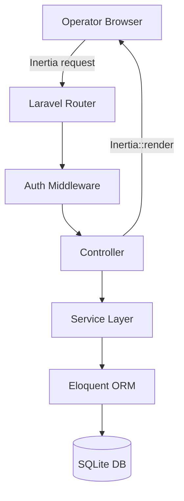

# Design Document: eBay Dropshipping Platform

## Overview

The eBay Dropshipping Platform is a single-user web application that manages the full dropshipping workflow: product sourcing, listing creation, margin tracking, order recording, inventory monitoring, and performance dashboarding. It is built on **Laravel 11** (PHP 8.2+), **Vue 3**, and **Inertia.js**, with a SQLite database for the MVP. Authentication is provided by Laravel Breeze (session-based). The platform is manual-first — no live eBay API integration is required for the MVP.

The existing codebase already scaffolds the four core models (`User`, `Product`, `Listing`, `Order`), their migrations, and basic read-only controllers. This design describes the complete intended system, including all gaps that must be built.

---

## Architecture

The application follows a standard **Laravel MVC + Inertia SPA** pattern:

```
Browser (Vue 3 SPA)
      │  Inertia.js (XHR / full-page)
      ▼
Laravel Router → Middleware (auth, ownership) → Controller
      │
      ├── Service Layer  (ProfitCalculator, CsvImportService, RevisionService, SettingsService)
      ├── Eloquent Models (User, Product, Listing, Order, Revision, Setting)
      └── Database (SQLite / MySQL)
```

Key architectural decisions:

- **Service objects** encapsulate business logic (profit calculation, CSV import, revision recording, settings) so controllers stay thin.
- **Settings** are stored as key-value rows in a `settings` table scoped to the user, loaded once per request and cached in memory.
- **Revisions** are written inside a database transaction alongside the Listing update to guarantee consistency.
- **Stock decrement on delivery** is handled in `OrderService::markDelivered()` inside a transaction with a pessimistic lock on the Product row.
- **Reactive margin recalculation** on the Settings page is handled client-side in Vue using computed properties; no extra HTTP round-trip is needed.



---

## Components and Interfaces

### Controllers

| Controller | Routes | Responsibility |
|---|---|---|
| `DashboardController` | `GET /` | Aggregate stats + recent records |
| `ProductController` | `GET/POST /products`, `GET/PUT/DELETE /products/{id}` | Full CRUD + ownership check |
| `ProductImportController` | `POST /products/import` | CSV upload and import |
| `ListingController` | `GET/POST /listings`, `GET/PUT/DELETE /listings/{id}` | Full CRUD + revision recording |
| `OrderController` | `GET/POST /orders`, `GET/PUT/DELETE /orders/{id}` | Full CRUD + fulfillment transitions |
| `SettingsController` | `GET/POST /settings` | Read and persist user settings |

### Services

**`ProfitCalculator`**
```php
// Computes margin for a product or listing given settings
computeProductMargin(Product $product, Setting $settings): float
computeListingMargin(Listing $listing, Setting $settings): float
// margin = price - cost - (price * fee_rate) - shipping_cost
```

**`CsvImportService`**
```php
import(UploadedFile $file, User $user): ImportResult
// Returns: ImportResult { imported: int, skipped: int, errors: array<int, string> }
```

**`RevisionService`**
```php
record(Listing $listing, array $oldValues, array $newValues): void
// Writes one Revision row per changed field inside the caller's transaction
```

**`SettingsService`**
```php
getForUser(int $userId): UserSettings
save(int $userId, array $data): UserSettings
// UserSettings DTO: ebay_fee_rate, default_shipping_cost, low_stock_threshold, min_margin_threshold
```

**`OrderService`**
```php
markDelivered(Order $order): void
// Sets fulfillment_status = delivered, records delivered_at, decrements product stock
```

### Vue Pages

| Page | Route | Key Props |
|---|---|---|
| `Dashboard` | `/` | `stats`, `recent_products`, `recent_listings`, `recent_orders`, `attention_listings`, `top_products` |
| `Products/Index` | `/products` | `products` (with computed margin, low_stock flag) |
| `Products/Create` | `/products/create` | — |
| `Products/Edit` | `/products/{id}/edit` | `product` |
| `Products/Import` | `/products/import` | — |
| `Listings/Index` | `/listings` | `listings` (with margin, product title) |
| `Listings/Create` | `/listings/create` | `products` (for product selector) |
| `Listings/Show` | `/listings/{id}` | `listing`, `revisions` |
| `Listings/Edit` | `/listings/{id}/edit` | `listing`, `products` |
| `Orders/Index` | `/orders` | `orders`, `filters` |
| `Orders/Create` | `/orders/create` | `listings`, `products` |
| `Orders/Edit` | `/orders/{id}/edit` | `order` |
| `Settings/Index` | `/settings` | `settings` |

---

## Data Models

### Existing Tables (already migrated)

**`products`**
| Column | Type | Notes |
|---|---|---|
| `id` | bigint PK | |
| `user_id` | FK → users | cascade delete |
| `title` | string | required |
| `sku` | string nullable | |
| `category` | string nullable | |
| `supplier_name` | string nullable | |
| `source_url` | string nullable | |
| `cost` | decimal(10,2) | ≥ 0 |
| `target_price` | decimal(10,2) | ≥ 0 |
| `stock_quantity` | unsigned int | ≥ 0 |
| `listing_status` | string | enum: draft/ready/active/paused/sold/archived |
| `notes` | text nullable | |
| `last_sold_at` | timestamp nullable | |

**`listings`**
| Column | Type | Notes |
|---|---|---|
| `id` | bigint PK | |
| `user_id` | FK → users | cascade delete |
| `product_id` | FK → products | cascade delete |
| `marketplace_item_id` | string nullable | |
| `title` | string | required |
| `external_url` | string nullable | |
| `price` | decimal(10,2) | ≥ 0 |
| `quantity` | unsigned int | default 1 |
| `status` | string | enum: draft/ready/active/paused/sold/archived |
| `last_synced_at` | timestamp nullable | |
| `notes` | text nullable | |

**`orders`**
| Column | Type | Notes |
|---|---|---|
| `id` | bigint PK | |
| `user_id` | FK → users | cascade delete |
| `listing_id` | FK → listings nullable | null on delete |
| `product_id` | FK → products nullable | null on delete |
| `order_number` | string nullable | |
| `buyer_name` | string nullable | |
| `sale_price` | decimal(10,2) | required |
| `quantity` | unsigned int | default 1 |
| `fulfillment_status` | string | enum: pending/processing/shipped/delivered/cancelled/exception |
| `payment_status` | string | default unpaid |
| `stripe_checkout_session_id` | string nullable | |
| `stripe_payment_intent_id` | string nullable | |
| `paid_at` | timestamp nullable | |
| `ordered_at` | timestamp nullable | |
| `shipped_at` | timestamp nullable | |
| `delivered_at` | timestamp nullable | **new column needed** |
| `tracking_number` | string nullable | |
| `notes` | text nullable | |

### New Tables (to be migrated)

**`revisions`**
| Column | Type | Notes |
|---|---|---|
| `id` | bigint PK | |
| `listing_id` | FK → listings | cascade delete |
| `field` | string | name of changed field |
| `old_value` | text nullable | previous value |
| `new_value` | text nullable | new value |
| `created_at` | timestamp | change timestamp |

Index: `(listing_id, created_at DESC)`

**`settings`**
| Column | Type | Notes |
|---|---|---|
| `id` | bigint PK | |
| `user_id` | FK → users | cascade delete |
| `key` | string | setting name |
| `value` | text nullable | serialised value |

Unique index: `(user_id, key)`

Default setting values:

| Key | Default |
|---|---|
| `ebay_fee_rate` | `0.1295` (12.95%) |
| `default_shipping_cost` | `0.00` |
| `low_stock_threshold` | `5` |
| `min_margin_threshold` | `0.00` |

### Eloquent Relationships

```
User
 ├── hasMany Product
 ├── hasMany Listing
 ├── hasMany Order
 └── hasMany Setting

Product
 ├── belongsTo User
 ├── hasMany Listing
 └── hasMany Order

Listing
 ├── belongsTo User
 ├── belongsTo Product
 ├── hasMany Order
 └── hasMany Revision

Order
 ├── belongsTo User
 ├── belongsTo Listing (nullable)
 └── belongsTo Product (nullable)

Revision
 └── belongsTo Listing
```

### Margin Calculation Formula

```
margin = price - cost - (price × ebay_fee_rate) - default_shipping_cost
```

- For a **Product**: `price = target_price`, `cost = product.cost`
- For a **Listing**: `price = listing.price`, `cost = listing.product.cost`
- `ebay_fee_rate` and `default_shipping_cost` come from the user's Settings
- Margin is computed at read time (not stored) to stay in sync with settings changes

### CSV Import Column Mapping

Expected CSV headers (case-insensitive, extras ignored):

```
title, sku, category, supplier_name, cost, target_price, stock_quantity, notes
```

Required columns per row: `title`, `cost`, `target_price`. Rows missing any of these are skipped with a row-level error message.

---

## Correctness Properties

*A property is a characteristic or behavior that should hold true across all valid executions of a system — essentially, a formal statement about what the system should do. Properties serve as the bridge between human-readable specifications and machine-verifiable correctness guarantees.*

### Property 1: Product creation round-trip

*For any* valid product payload (non-empty title, non-negative cost, non-negative target price, non-negative stock quantity), submitting a create request should result in a product record persisted in the database with all submitted field values matching, associated with the authenticated user.

**Validates: Requirements 1.2**

---

### Property 2: Required field validation rejects incomplete products

*For any* product submission that omits one or more of the required fields (title, cost, target_price, stock_quantity), or supplies a negative value for cost, target_price, or stock_quantity, the Platform should reject the request and return a validation error referencing each offending field.

**Validates: Requirements 1.3, 1.4, 1.5**

---

### Property 3: Product list ordering

*For any* set of products belonging to a user, the product list endpoint should return them ordered by `created_at` descending (most recently created first).

**Validates: Requirements 1.9**

---

### Property 4: Ownership enforcement returns 403

*For any* resource (Product, Listing, or Order) belonging to user A, a request from user B targeting that resource should receive a 403 Forbidden response, and the resource should remain unchanged.

**Validates: Requirements 1.10, 8.3, 8.4**

---

### Property 5: CSV import row count invariant

*For any* CSV file with N total rows, where V rows are valid (have title, cost, and target_price) and S rows are invalid, the import result should satisfy: `imported = V`, `skipped = S`, and `imported + skipped = N`.

**Validates: Requirements 2.1, 2.2, 2.3**

---

### Property 6: CSV column mapping round-trip

*For any* CSV row containing values for title, sku, category, supplier_name, cost, target_price, stock_quantity, and notes, the imported Product record should have each field set to the corresponding CSV column value.

**Validates: Requirements 2.5**

---

### Property 7: Listing pre-population from product

*For any* product, creating a new listing from that product should result in the listing's title equalling the product's title and the listing's price equalling the product's target_price.

**Validates: Requirements 3.1**

---

### Property 8: Revision completeness on listing update

*For any* listing update that changes one or more of the tracked fields (title, price, quantity, status, notes), the system should create exactly one Revision record per changed field, each containing the correct listing_id, field name, previous value, new value, and a timestamp equal to the time of the update.

**Validates: Requirements 3.4, 9.1, 9.2**

---

### Property 9: Revision ordering

*For any* listing with multiple revisions, the revision history endpoint should return revisions ordered by `created_at` descending.

**Validates: Requirements 3.5, 9.3**

---

### Property 10: Cascade delete removes revisions

*For any* listing that has associated revisions, deleting the listing should result in all of its revision records also being deleted, leaving no orphaned revision rows.

**Validates: Requirements 3.8, 9.4, 9.5**

---

### Property 11: Margin formula correctness

*For any* combination of price, cost, ebay_fee_rate, and shipping_cost values, the ProfitCalculator should return a margin equal to `price - cost - (price × ebay_fee_rate) - shipping_cost`, for both product margin (using target_price) and listing margin (using listing price and product cost).

**Validates: Requirements 4.1, 4.2**

---

### Property 12: Unprofitable flag when margin is negative

*For any* product or listing where the computed margin is less than zero, the item's response data should include an `is_unprofitable` flag set to true.

**Validates: Requirements 4.5**

---

### Property 13: Low-margin flag when margin is below threshold

*For any* product or listing where the computed margin is greater than or equal to zero but strictly less than the configured `min_margin_threshold`, the item's response data should include an `is_low_margin` flag set to true.

**Validates: Requirements 4.6**

---

### Property 14: Reactive margin recalculation

*For any* settings change to `ebay_fee_rate` or `default_shipping_cost`, the computed margin values displayed in the Vue component should update to reflect the new settings without a page reload, using the same formula as Property 11.

**Validates: Requirements 4.8**

---

### Property 15: Dashboard stats accuracy

*For any* state of the database, the dashboard stats object should satisfy: `products` equals the total product count for the user, `active_listings` equals the count of listings with status `active`, `pending_orders` equals the count of orders with fulfillment_status `pending`, `low_stock` equals the count of products with stock_quantity ≤ low_stock_threshold, and `potential_profit` equals the sum of (margin_per_unit × stock_quantity) for all products with stock_quantity > 0.

**Validates: Requirements 4.9, 7.1, 7.2, 7.3, 7.4, 7.5**

---

### Property 16: Dashboard recent items are correctly bounded and ordered

*For any* database state, the dashboard's `recent_products`, `recent_listings`, and `recent_orders` arrays should each contain at most 5 items, ordered by `created_at` descending.

**Validates: Requirements 7.6, 7.7, 7.8**

---

### Property 17: Attention Required surfaces stale draft/ready listings

*For any* listing with status `draft` or `ready` whose `updated_at` is more than 7 days in the past, that listing should appear in the dashboard's attention_listings collection.

**Validates: Requirements 7.9**

---

### Property 18: Top products by revenue ranking

*For any* database state, the dashboard's top_products list should contain at most 5 products, ordered by descending total revenue (sum of `sale_price × quantity` across all delivered orders linked to that product), and no product with zero delivered revenue should appear above a product with non-zero delivered revenue.

**Validates: Requirements 7.10**

---

### Property 19: Unauthenticated requests are redirected to login

*For any* protected route (any route other than login, registration, and password reset), an unauthenticated HTTP request should receive a redirect response to the login page.

**Validates: Requirements 8.1, 8.2**

---

### Property 20: Order fulfillment status filter

*For any* fulfillment_status filter value, the filtered order list should contain only orders whose fulfillment_status matches the filter, and no orders with a different status.

**Validates: Requirements 5.7**

---

### Property 21: Stock decrement on delivery

*For any* order linked to a product with stock_quantity S and order quantity Q where Q ≤ S, marking the order as delivered should result in the product's stock_quantity becoming S − Q. When Q > S, the product's stock_quantity should become 0 and the order's notes should contain a warning.

**Validates: Requirements 5.8, 5.9**

---

### Property 22: Auto-pause active listings when stock reaches zero

*For any* product whose stock_quantity transitions to 0, all listings associated with that product that have status `active` should have their status automatically changed to `paused`.

**Validates: Requirements 6.6**

---

### Property 23: Low-stock flag consistency

*For any* product with stock_quantity ≤ low_stock_threshold, the product list response should include a low-stock indicator for that product, and the dashboard low_stock count should include that product.

**Validates: Requirements 6.2, 6.3**

---

### Property 24: Settings validation and round-trip

*For any* valid settings payload (ebay_fee_rate in [0, 100], default_shipping_cost ≥ 0, low_stock_threshold > 0, min_margin_threshold ≥ 0), saving the settings should persist all values and subsequent reads should return the same values. For any invalid payload (fee_rate outside [0, 100], negative shipping cost, non-positive threshold), the save should be rejected with a field-level validation error.

**Validates: Requirements 10.2, 10.3, 10.4, 10.5, 10.6, 10.7**

---

## Error Handling

### Validation Errors

All form submissions are validated server-side using Laravel's `Request::validate()`. Validation errors are returned as Inertia shared errors and displayed inline next to each field using the existing `InputError` component. No form submission should silently fail.

### Ownership / Authorization Errors

Every controller action that operates on a user-owned resource calls `abort_unless($resource->user_id === $request->user()->id, 403)` before proceeding. This returns a 403 JSON response for Inertia requests and a 403 HTML page for full-page requests.

### CSV Import Errors

The `CsvImportService` collects row-level errors into an `ImportResult` object. The controller returns the result to the Vue page as an Inertia prop. The page displays a summary table listing each skipped row number and its error reason. The import never throws an exception for row-level failures; only file-level failures (invalid MIME type, unreadable file) throw and are caught by the controller to return a user-facing error message.

### Stock Underflow on Delivery

When `OrderService::markDelivered()` detects that the order quantity exceeds the product's current stock, it sets `stock_quantity = 0` and appends a warning string to `order.notes`. This is not treated as an error that blocks the delivery — the order is still marked delivered, but the anomaly is recorded.

### Out-of-Stock Listing Activation

When a listing status change to `active` is attempted and the product's `stock_quantity` is 0, the `ListingController::update()` method returns a validation error with the message "Cannot activate listing: product is out of stock." This is surfaced as a field-level error on the status field.

### Database Transaction Failures

The revision recording and stock decrement operations run inside `DB::transaction()`. If any step fails, the transaction rolls back and a 500 error is returned. Laravel's default exception handler logs the error and returns a generic error page.

### Settings Not Found

If a user has no settings row for a given key, `SettingsService::getForUser()` returns the default value for that key. Settings are never null at the application layer.

---

## Testing Strategy

### Dual Testing Approach

The test suite uses both **unit/feature tests** (PHPUnit, Laravel's built-in test helpers) and **property-based tests** (using [**eris/eris**](https://github.com/giorgiosironi/eris) for PHP property-based testing). Both are required for comprehensive coverage.

- **Feature tests** cover specific examples, integration points, edge cases, and error conditions.
- **Property tests** verify universal properties across many generated inputs, catching bugs that specific examples miss.

### Unit and Feature Tests (PHPUnit)

Key test classes:

| Test Class | Covers |
|---|---|
| `ProductControllerTest` | CRUD, validation, ownership (403), ordering |
| `ProductImportControllerTest` | CSV upload, row skipping, summary, invalid file |
| `ListingControllerTest` | CRUD, pre-population, out-of-stock block, revision creation |
| `OrderControllerTest` | CRUD, fulfillment transitions, shipped requires tracking, delivered timestamp |
| `DashboardControllerTest` | Stats accuracy, recent items, attention listings, top products |
| `SettingsControllerTest` | Read, save, validation, defaults |
| `ProfitCalculatorTest` | Formula correctness, edge values (zero cost, zero fee) |
| `OrderServiceTest` | Stock decrement, underflow warning, auto-pause |
| `RevisionServiceTest` | Revision creation per changed field, no revision when unchanged |
| `CsvImportServiceTest` | Valid rows imported, invalid rows skipped, column mapping |

Edge cases to cover explicitly in feature tests:
- Negative cost/price/stock rejected (Requirements 1.4, 1.5)
- Fee rate outside 0–100 rejected (Requirement 10.7)
- Listing activation blocked when stock = 0 (Requirements 3.6, 6.4)
- Shipped status requires tracking number (Requirement 5.4)
- Stock underflow sets quantity to 0 and records warning (Requirement 5.9)
- Non-CSV file upload rejected (Requirement 2.4)

### Property-Based Tests (eris/eris)

Each property test runs a minimum of **100 iterations** with randomly generated inputs.

Each test is tagged with a comment in the format:
`// Feature: ebay-dropshipping-platform, Property N: <property_text>`

| Property Test | Design Property | Generator Strategy |
|---|---|---|
| `testProductCreationRoundTrip` | Property 1 | Generate random valid product payloads |
| `testRequiredFieldValidation` | Property 2 | Generate payloads with random subsets of required fields removed or set to negative |
| `testProductListOrdering` | Property 3 | Generate N products with random created_at values, verify order |
| `testOwnershipEnforcement` | Property 4 | Generate two users and random resources, verify 403 for cross-user access |
| `testCsvImportRowCountInvariant` | Property 5 | Generate CSVs with random mix of valid and invalid rows |
| `testCsvColumnMappingRoundTrip` | Property 6 | Generate random product data, write to CSV, import, verify fields |
| `testListingPrePopulation` | Property 7 | Generate random products, create listings, verify title/price match |
| `testRevisionCompletenessOnUpdate` | Property 8 | Generate random listing updates, verify revision count and field values |
| `testRevisionOrdering` | Property 9 | Generate multiple updates to a listing, verify descending order |
| `testCascadeDeleteRemovesRevisions` | Property 10 | Generate listing with revisions, delete, verify no orphans |
| `testMarginFormulaCorrectness` | Property 11 | Generate random price/cost/fee/shipping values, verify formula |
| `testUnprofitableFlag` | Property 12 | Generate items where margin < 0, verify flag |
| `testLowMarginFlag` | Property 13 | Generate items where 0 ≤ margin < threshold, verify flag |
| `testDashboardStatsAccuracy` | Property 15 | Generate random DB state, verify all stat values |
| `testDashboardRecentItemsBounded` | Property 16 | Generate > 5 items, verify at most 5 returned in correct order |
| `testAttentionListingsStaleness` | Property 17 | Generate listings with random updated_at values, verify attention set |
| `testTopProductsRanking` | Property 18 | Generate random orders, verify top 5 ranking by revenue |
| `testOrderStatusFilter` | Property 20 | Generate orders with random statuses, apply filter, verify result |
| `testStockDecrementOnDelivery` | Property 21 | Generate orders with random quantities and stock levels, verify decrement |
| `testAutoPauseOnZeroStock` | Property 22 | Generate products with active listings, set stock to 0, verify pause |
| `testLowStockFlagConsistency` | Property 23 | Generate products with random stock levels and thresholds, verify flags |
| `testSettingsValidationAndRoundTrip` | Property 24 | Generate valid and invalid settings payloads, verify persistence and rejection |
